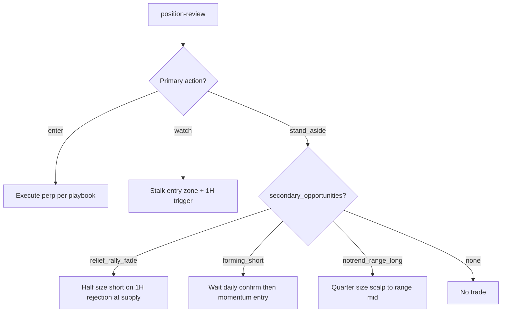

# Crypto Strategy Review — BTC/ETH + ETH Options

> **Date:** 2026-06-16  
> **Branch:** `qa/crypto_review`  
> **Trigger:** ~10% BTC/ETH rally while alignment still reads short; explore notrend lanes and forming short setups.

## Executive summary

The primary stack (COT → regime → momentum 4H/1H → perp) was **correctly bearish** through early June when COT specs were crowded long (P97–P99). After the relief rally, two gaps appeared:

1. **Regime disarmed too aggressively** — `assess_regime()` required COT percentile ≥ 68. When specs unwound to P50, the entire bear regime collapsed to `neutral` even though COT confidence stayed ~72% and drawdown from 28d high remained 16–18%.
2. **No secondary lane** — Relief rallies and notrend scalps had logic in `regime.py` (`relief_rally_fade`) but never surfaced in `position-review` when the primary action was `stand_aside`.

### Changes in this PR

| Area | Change |
|------|--------|
| Regime gating | Arm COT-led regime on **confidence ≥ 65%** OR crowded percentile (≥ 68) |
| Secondary opportunities | New `opportunities.py` — relief rally fade, forming short, notrend range long |
| Review output | `secondary_opportunities` + `market_context` per coin |
| Daily display | Secondary table when primary is blocked |

---

## Live market read (2026-06-16)

| Coin | Spot | 28d drawdown | 14d bounce | COT | Regime (before) | Regime (after fix) |
|------|------|--------------|------------|-----|-----------------|-------------------|
| BTC | $65,762 | 15.9% | 8.3% | bearish 72% P50 | neutral | leg_down / relief_rally_fade |
| ETH | $1,776 | 17.7% | 10.7% | bearish 73% P50 | neutral | leg_down / relief_rally_fade |

**What happened:** Specs covered shorts during the rally → percentile dropped from P97 to P50. Macro bear thesis is *weaker* but not gone. Price is bouncing into supply on 4H while daily remains below slow EMA.

**Primary stack today:** Still `stand_aside` — no tradeable momentum (scores 42–52 vs 78 threshold), theory v2 blocked at daily confirmation.

**Secondary lanes now visible:**
- `relief_rally_fade` — short into supply on 1H rejection (half size)
- `forming_short` — ETH short score 52, waiting daily confirm
- `notrend_range_long` — counter-trend scalp if price in lower half of range (quarter size)

---

## Why alignment said short during the rally

This is **by design**, not a bug:

```
Weekly  → COT bearish (specs crowded long historically)
Daily   → Below 50 EMA — no bullish confirmation
4H/1H   → Counter-trend bounce (positive 4H slope) — momentum long vetoed by weekly short bias
```

The ~10% move was a **relief rally inside a bear leg**, not a regime flip. The system avoided chasing longs because:
- Theory overlay: `weekly theory bias short conflicts with long`
- Momentum long plans score ~41–51 (below 78 tradeable threshold)
- Participation filter failing (volume_ratio ≈ 0 on recent bars)

**Missed profit type:** Not trend longs — but potential **fade shorts at supply** and **notrend scalps** that were never surfaced in the CLI output.

---

## Forming short setups we're now surfacing

### ETH (stronger candidate)
- Short momentum score: **52** (highest)
- Theory blocker: `daily theory confirmation is missing`
- 4H slope: +41 bps (counter-trend bounce exhausting)
- **Action:** Watch for daily close below 20 EMA + 4H lower-high → enter short on breakdown retest

### BTC
- Short score: **42** — below forming threshold (45)
- Same theory blocker
- **Action:** WATCH only via relief_rally_fade; no forming_short until score ≥ 45

---

## ETH options (Deribit)

Options lane remains **advisory** — quality gate blocks execution (high touch, income-first design).

| Regime | Preferred structure | DTE |
|--------|---------------------|-----|
| relief_rally_fade | bear_put_debit_spread | 7–14 |
| leg_down continuation | bear_put_debit_spread | 14–30 |
| notrend_range_long | iron_condor / bull_put_credit (advisory only) | 7 |

**Current:** No executable options — wait for 1H rejection in supply before sizing bear put spreads.

---

## Recommended operator workflow

```bash
# Full review with secondary lanes
nave crypto position-review --coins BTC,ETH

# Momentum detail (scores, theory blockers)
nave crypto momentum-scan --symbols BTCUSDT,ETHUSDT --json

# Thesis invalidation check
python scripts/crypto_thesis_check.py
```

### Decision tree



---

## Open questions for iteration

1. **COT percentile vs confidence weighting** — Should P50 + 72% conf arm `cot_bear_bias` only (softer) vs full `leg_down`?
2. **Notrend sizing** — Quarter size is documented; should the engine emit explicit sizing?
3. **Options in relief rallies** — Consider lowering touch gate for defined-risk debit spreads when regime = relief_rally_fade
4. **Momentum threshold in quiet cadence** — Scores 52 blocked at 78; adaptive threshold recommends 81. Consider regime-aware threshold reduction for forming shorts.

---

## Files changed

- `trading/crypto/analysis/regime.py` — confidence-based regime arming
- `trading/crypto/analysis/opportunities.py` — secondary opportunity detection (new)
- `trading/crypto/analysis/review.py` — wire secondary output
- `trading/crypto/analysis/daily_display.py` — secondary table
- `trading/crypto/analysis/regime_defaults.json` — new thresholds
- `tests/test_opportunities.py` — coverage